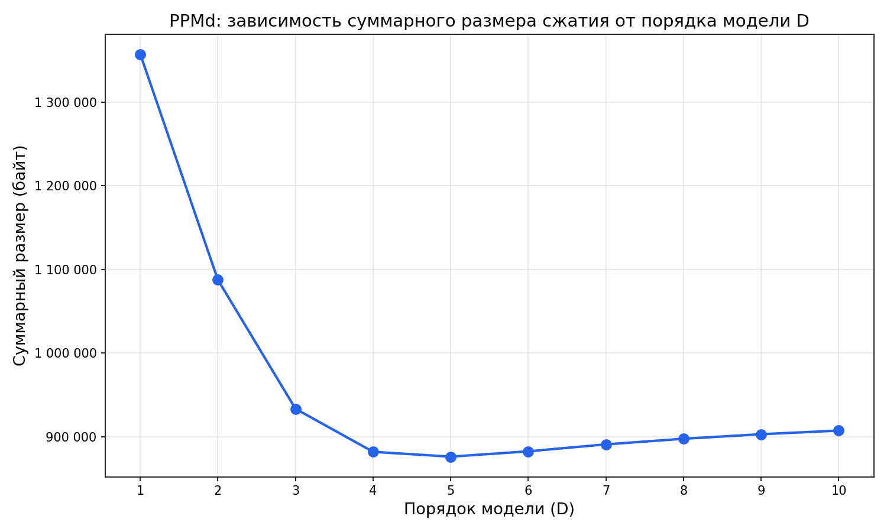
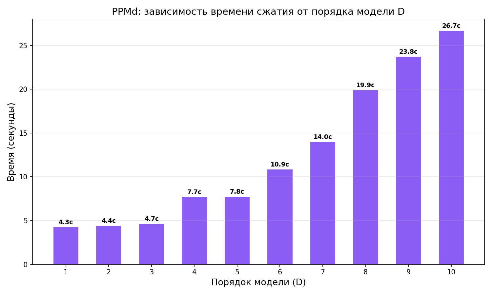
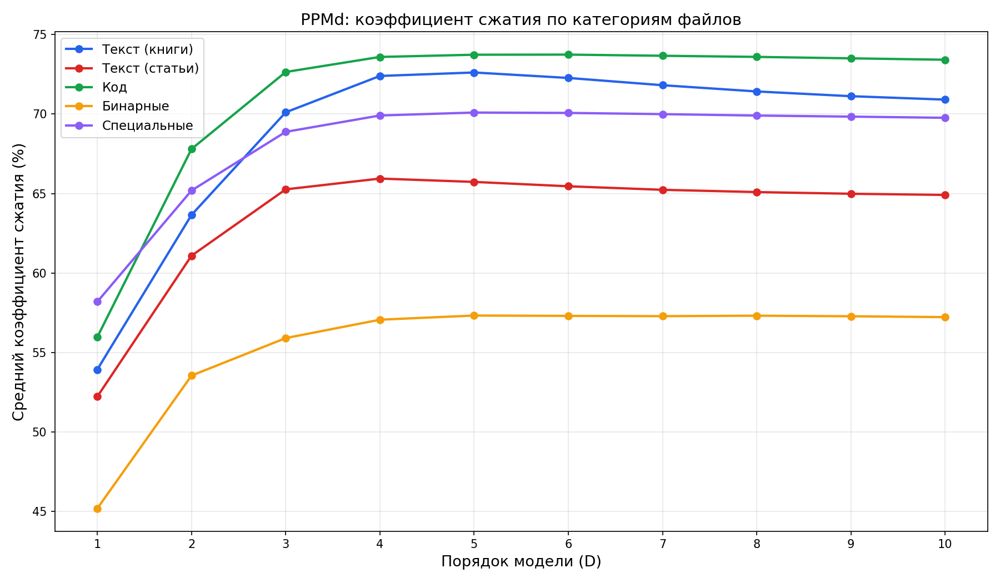
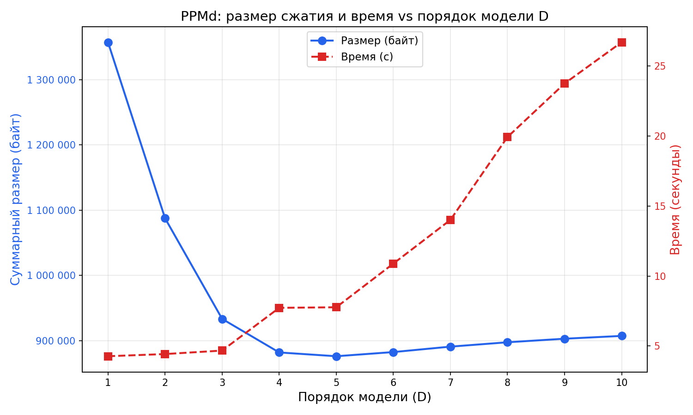

# Исследование зависимости эффективности сжатия PPMd от порядка модели D

## 1. Цель исследования

Исследовать влияние параметра **D** (максимальный порядок контекстной модели) на эффективность сжатия алгоритма PPMd
(Prediction by Partial Matching, вариант D) на данном наборе данных.

## 2. Методология

> **[ВАЖНО]** Исследование производилось до оптимизации алгоритма путём выбора наилучшего праметра D для каждого файла.

**Алгоритм:** PPMd с порогом рескейлинга 8192.

**Набор данных:** — 18 файлов различных типов: текст (книги, научные статьи, новости), исходный код, бинарные
объектные файлы, географические данные, изображения.

**Параметры эксперимента:**

- Порядок модели D = 1, 2, 3, 4, 5, 6, 7, 8, 9, 10
- Каждый файл сжимается и декодируется с проверкой бит-точного восстановления
- Замеряются: размер сжатого файла (байт), коэффициент сжатия (%), общее время обработки

## 3. Результаты

### 3.1 Сводная таблица

|   D   | Суммарный размер (байт) | Коэфф. сжатия (%) | Время (с) | Δ от лучшего |
|:-----:|------------------------:|------------------:|----------:|-------------:|
|   1   |               1 357 490 |             62,95 |       4,3 |       +55,0% |
|   2   |               1 087 622 |             70,32 |       4,4 |       +24,1% |
|   3   |                 933 420 |             74,53 |       4,7 |        +6,5% |
|   4   |                 881 995 |             75,93 |       7,7 |        +0,7% |
| **5** |             **876 216** |         **76,09** |   **7,8** |       **0%** |
|   6   |                 882 584 |             75,92 |      10,9 |        +0,7% |
|   7   |                 890 911 |             75,69 |      14,0 |        +1,7% |
|   8   |                 897 604 |             75,51 |      19,9 |        +2,4% |
|   9   |                 903 046 |             75,36 |      23,8 |        +3,1% |
|  10   |                 907 338 |             75,24 |      26,7 |        +3,6% |

> **Оптимальное значение: D = 5** — минимальный суммарный размер 876 216 байт.

### 3.2 Результаты по файлам (D = 5, оптимальный)

| Файл      | Тип           | Оригинал (байт) | Сжатый (байт) | Коэфф. (%) |
|-----------|---------------|:---------------:|:-------------:|:----------:|
| bib       | библиография  |     111 261     |    28 067     |   74,77    |
| book1     | текст (книга) |     768 771     |    223 542    |   70,92    |
| book2     | текст (книга) |     610 856     |    156 946    |   74,31    |
| geo       | геоданные     |     102 400     |    63 375     |   38,11    |
| news      | новости       |     377 109     |    119 090    |   68,42    |
| obj1      | объектный код |     21 504      |    11 212     |   47,86    |
| obj2      | объектный код |     246 814     |    81 946     |   66,80    |
| paper1    | статья        |     53 161      |    16 485     |   68,99    |
| paper2    | статья        |     82 199      |    24 751     |   69,89    |
| paper3    | статья        |     46 526      |    15 747     |   66,15    |
| paper4    | статья        |     13 286      |     5 092     |   61,67    |
| paper5    | статья        |     11 954      |     4 777     |   60,04    |
| paper6    | статья        |     38 105      |    12 327     |   67,65    |
| pic       | изображение   |     513 216     |    52 583     |   89,75    |
| progc     | код C         |     39 611      |    12 730     |   67,86    |
| progl     | код Lisp      |     71 646      |    16 787     |   76,57    |
| progp     | код Pascal    |     49 379      |    11 474     |   76,76    |
| trans     | транскрипция  |     93 695      |    19 282     |   79,42    |
| **Всего** |               |  **3 664 813**  |  **876 216**  | **76,09**  |

### 3.3 Графики

#### 3.3.1 Суммарный размер сжатия vs D

Зависимость имеет чёткий минимум при D = 5. При D < 5 недостаточная длина контекста приводит к неточным предсказаниям.
При D > 5 модель начинает страдать от разрежённости статистики в высокопорядковых контекстах.

#### 3.3.2 Время сжатия vs D

Время растёт приблизительно линейно с ростом D, с заметным скачком между D = 3 и D = 4 (с ~4,7 до ~7,7 секунд). При D =
10 время достигает ~26,7 секунд — в 6,2 раза больше, чем при D = 1.

#### 3.3.3 Коэффициент сжатия по категориям файлов

Разные типы файлов по-разному реагируют на увеличение порядка модели:

- **Код** (progc, progl, progp) — наибольший выигрыш от увеличения D, т.к. синтаксические конструкции хорошо
  предсказуемы в длинных контекстах
- **Текст** (книги и статьи) — стабильный рост до D = 4–5, затем плато
- **Бинарные** (obj1, obj2) — умеренный выигрыш, obj1 практически не меняется
- **Специальные** — `pic` стабильно ~89,7% при любом D (структура изображения хорошо предсказуема даже с короткими
  контекстами), `geo` практически не реагирует на D (~38%)

#### 3.3.4 Размер и время (двойная ось)

Совмещённый график демонстрирует компромисс: после D = 5 размер начинает расти, а время продолжает увеличиваться —
эффективность (сжатие/время) монотонно падает.

## 4. Анализ

### 4.1 Почему D = 5 оптимален?

Порядок модели D определяет максимальную длину контекста, используемого для предсказания следующего символа. Существует
баланс между двумя факторами:

1. **Недостаточный контекст (D < 5):** короткие контексты не улавливают долгосрочные зависимости в данных. Например, при
   D = 1 модель видит только предыдущий байт, что даёт лишь базовые биграмные статистики.

2. **Разреженность статистики (D > 5):** длинные контексты встречаются реже, и модель не успевает накопить достаточно
   наблюдений для точных оценок вероятностей. Это приводит к частым escape-переходам к контекстам меньшего порядка,
   каждый из которых «стоит» дополнительные биты.

### 4.2 Зона «плато» (D = 4–6)

Разница между D = 4, 5 и 6 составляет менее 1% (881 995 — 876 216 — 882 584 байт). Это означает, что для данного архива
контексты длиной 4–6 байт захватывают подавляющую часть полезной статистики.

### 4.3 Компромисс сжатие/время

| D | Размер (байт) | Время (с) | Байт/с экономии |
|:-:|:-------------:|:---------:|:---------------:|
| 5 |    876 216    |    7,8    |     357 513     |
| 4 |    881 995    |    7,7    |     361 401     |
| 3 |    933 420    |    4,7    |     581 148     |

При D = 3 достигается наилучшее соотношение скорости к качеству сжатия (хотя абсолютный результат хуже). Для задач, где
критична скорость, D = 3–4 может быть предпочтительнее.

### 4.4 Влияние типа данных

- **Файлы с высокой энтропией** (geo, obj1) практически не выигрывают от увеличения D, т.к. данные плохо предсказуемы в
  принципе
- **Файлы с высокой избыточностью** (pic — 89,7%, trans — 79,4%) выигрывают от PPMd уже при малых D, т.к. локальные
  паттерны очень сильны
- **Текст и код** — основные бенефициары увеличения D до 4–5

## 5. Выводы

1. **Оптимальный порядок модели D = 5**, обеспечивающий минимальный суммарный размер сжатых файлов —
   **876 216 байт** (коэффициент сжатия 76,09%)

2. Зависимость имеет чёткий **выпуклый минимум**: при D < 5 качество растёт за счёт лучшего контекстного моделирования,
   при D > 5 — падает из-за разреженности статистики

3. Время сжатия **растёт практически линейно** с D, от ~4,3 с (D=1) до ~26,7 с (D=10)

4. Тип данных существенно влияет на чувствительность к D: текстовые данные и код наиболее чувствительны, бинарные и
   данные с высокой энтропией — наименее
